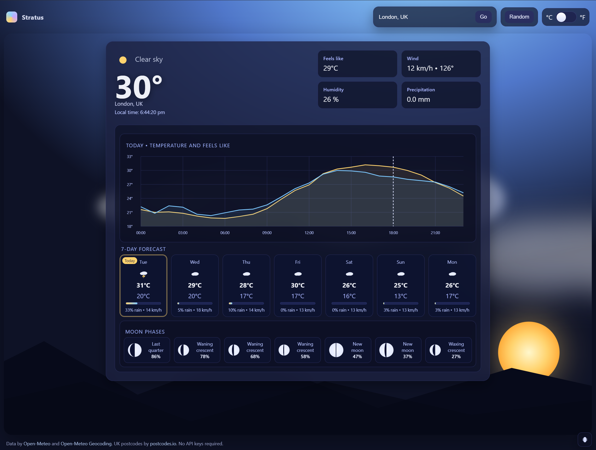

# Stratus

A single-file, offline-friendly weather web app. It shows a 24-hour temperature chart, a 7-day forecast, local moon phases, and animated time-of-day gradients. Works with place search and UK postcodes. No API keys needed.

[Launch Stratus](https://swiftredvox.github.io/stratus/)

## Features
- Today chart: temperature vs “feels like” with a current-time marker
- 7-day forecast with “Today” highlighted
- Moon phases (calculated locally)
- Time-of-day sky gradients and mountains
- Place search and **UK postcode** support (e.g., `EC1A 1BB`)
- Responsive layout; carousels on small screens

## Screenshot

## Data & services
- Weather & geocoding: [Open-Meteo](https://open-meteo.com/)
- UK postcode lookup: [postcodes.io](https://postcodes.io/)
- All requests use HTTPS; no cookies, analytics, or tracking.

## Query parameters
- `?q=Amsterdam, NL` – load by place name  
- `?postal=CV1 3LJ` – load by UK postcode  
- `?debug=1` – (optional) show extra console controls

## Known limits
- Hourly “feels like” may fall back to temperature if the API omits it.
- When offline, existing UI renders but live data won’t refresh.

## License
**CC0** — public domain dedication. Please retain the Open-Meteo and postcodes.io credits in the footer.
